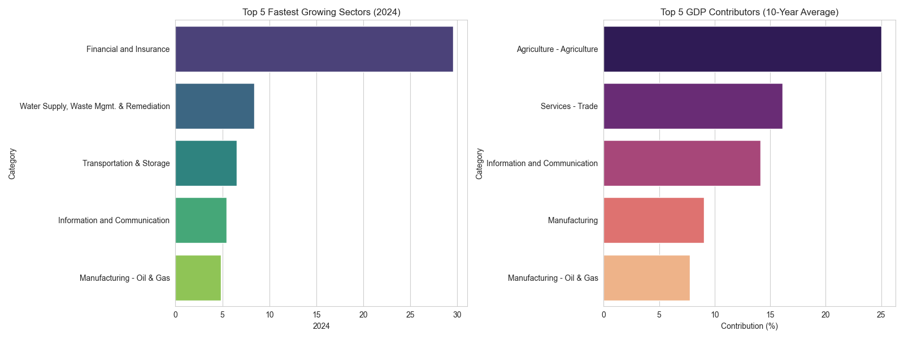
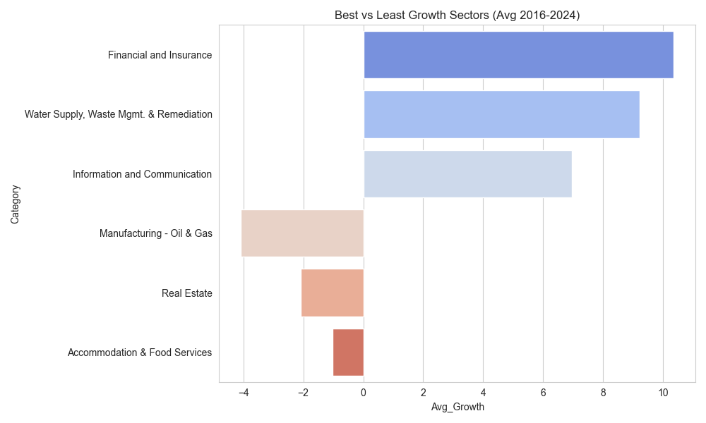
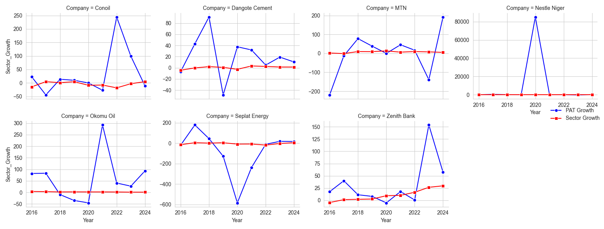

# Analytical Report on Nigeria’s Economy: Performance & Way Forward (2015–2024)

**Date:** December 31, 2025

**Prepared by:** `Joshua Edun`

**Tools Used:** Python (Pandas, Matplotlib, Seaborn)

---

## 📌 Executive Summary

### The "K-Shaped" Economic Divergence

According to Investopedia.com, a K-shaped recovery "occurs when, following a recession, different parts of the economy recover at different rates, times, or magnitudes".

The data tells a similar story in the Nigerian economy: while the financial and digital economies are booming, the real sector — manufacturing, telecommunications, and consumer goods — is contracting.
This is driven by aggressive currency devaluation, the removal of the petrol subsidy, and persistent security challenges in the agricultural belt, which have displaced over 3.3 million people as of 2024 (IDMC, 2024).

### Key Highlights

- **Financial Sector Boom:** The Financial & Insurance sector has decoupled from the broader economy, recording a **29.6% YoY growth in 2024**. This is largely a result of high-interest-rate environments and foreign exchange (FX) revaluation gains.

- **Cost of Living Crisis:** Inflation has become a chronic issue. In 2024, **Imported Food inflation reached 41.3%**. The average Nigerian's diet is being affected by exchange rate volatility.

- **Corporate Profitability Shift:** While **Zenith Bank** saw profits jump by **153% in 2023**, industrial giants like **MTN Nigeria** and **Nestlé Nigeria** recorded losses, with MTN’s losses widening by **192% in 2024** due to massive FX-related liabilities (MTN Nigeria, 2024).

### Core Insight

Policy intervention must shift from targeting mere GDP growth to **sector-specific stabilization**, particularly focusing on the FX-exposed manufacturing and telecommunications sectors which are the country's primary non-oil employers.

---

## 📊 1. GDP Analysis: The Shift from Oil to Services

### Overview

For decades, Oil & Gas was the heartbeat of the nation, but between 2015 and 2024, the sector has struggled with a **CAGR of -4.4%**. This decline is attributed to chronic underinvestment and crude oil theft, which cost the nation an estimated 400,000 barrels per day in 2023 (BusinessDay Nigeria, 2024).
In contrast, the Services sector—led by Finance and ICT has stepped in to fill the vacuum, though it does not yet provide the same level of foreign exchange liquidity as the oil sector once did.

### 🚀 Top 5 Sectors by Growth (2024)

1. **Financial & Insurance (29.61%):** Driven by high policy rates and dollar asset revaluation.
2. **Water Supply & Waste Management (8.40%):** Reflects increased urbanization and utility privatization.
3. **Transportation & Storage (6.54%):** Recovering from 2020-2022 downturns despite high fuel costs.
4. **Information & Communication (5.42%):** Sustained by the "necessity" of digital activity.
5. **Manufacturing - Oil & Gas (4.85%):** Driven by mild recovery in refining activities.

### 🧱 Top Contributors to GDP (2024)

1. **Agriculture (24.64%):** The nation's largest employer and safety net.
2. **Services - Trade (17.69%):** High volume but low margin.
3. **Information & Communication (17.68%):** The "new oil" of the economy.
4. **Manufacturing (8.64%):** Struggling with input costs.
5. **Financial & Insurance (6.22%):** High value-add despite lower employment footprint.

**Figure 1:** _Top 5 fastest growing sectors in 2024 vs. 10-year average contributors._

### 🏆 Best and Least Performers (10-Year Overview)

* **Best (Growth):** **Financial and Insurance**, with a 10-year average growth rate of .
* **Best (Contribution):** **Agriculture**, maintaining an average GDP contribution of .
* **Least (Growth):** **Manufacturing - Oil & Gas**, which averaged a contraction of .
* **Least (Contribution):** **Administrative & Support Services**, contributing only  on average.

**Figure 2:** *Comparison of the most and least successful sectors by average growth (2016-2024).*

---

## 📉 2. CPI & Inflation: The Food Security Emergency

### Inflation Dynamics

The removal of the fuel subsidy (2023) and Naira unification served as massive shocks. The "All Items" index has increased by **381.7%** cumulatively since 2015.

### 🔥 Highest Cost Drivers (2024)
The highest cost increases over the decade were concentrated in essential goods:

- **Imported Food (+41.3%):** Because Nigeria remains heavily dependent on imported wheat, sugar, and specialty fats, the devaluation of the Naira means food insecurity is on the rise.

- **General Food (+39.8%):** Driven by domestic logistics costs (diesel) and the displacement of farmers in the North-Central "food belt." due to conflict (Famine Early Warning Systems Network, 2024).

- **Transport (+31.7%):** Fuel prices has increased the "last-mile" cost of every good sold in the country.

**Figure 3:** _Components experiencing the highest cost-of-living increases over the last 10 years._

### 🔍 GDP vs. CPI Insights

* **Resilience:** The **ICT sector** remains resilient; digital services are inelastic—consumers maintain data usage despite rising prices.
* **The Squeeze:** **Manufacturing and Trade** are hurting. While their GDP volume might show slight growth, rising logistics and input costs are squeezing margins beyond what consumers can absorb.
* **The Beneficiary:** **Financial Services** often find a hedge in inflation, as rising prices lead to higher interest rates and FX revaluation gains for Tier-1 banks.

---

## 🏢 3. Company–Sector Analysis: A Tale of Two Economies

While a sector may show "growth" in GDP terms (which measures output volume), companies within that sector may be dying due to value erosion.

The relationship between a sector’s GDP (output volume) and a company’s Profit After Tax (PAT) has diverged significantly.

| Company | Respective Sector | Sector Trend (2024) | Company PAT Growth | Relationship Insight |
| --- | --- | --- | --- | --- |
| **Zenith Bank** | Financial & Insurance | +29.6% (Boom) | +57% | **Aligned:** High interest rates and FX gains boost both sector and PAT (Zenith Bank, 2024).|
| **Seplat Energy** | Mfg - Oil & Gas | +4.8% (Recovery) | +16.9% | **Resilient:** Dollarized revenues provide a natural hedge. |
| **MTN Nigeria** | ICT | +5.4% (Growth) | -192% (Loss) | **Diverged:** Volume is up, but USD-denominated debt destroyed PAT (MTN, 2024). |
| **Nestlé Niger** | Manufacturing | +8.6% (Growth) | -164.6bn (Loss) | **Distressed:** Unable to pass high input costs to weakened consumers (Nestlé, 2024). |
| **Okomu Oil** | Agriculture | +2.1% (Steady) | Growth | **Resilient:** Export-linked commodity pricing protects margins. |
| **Dangote Cement** | Manufacturing | +8.6% (Growth) | Downward Pressure | **Mixed:** High domestic demand (volume) but squeezed by energy costs and FX on spare parts. |
| **Conoil** | Mfg - Oil & Gas | +4.8% (Recovery) | Growth | **Resilient:** Beneficiary of subsidy removal and deregulation of downstream pricing. |

**Figure 4:** *Divergence between Sectoral GDP growth (Red) and Company PAT growth (Blue).*

### 🧠 Key Insight

Sectoral growth may not directly translate to a company's bottom-line performance. People are using more data (MTN) and buying more seasoning cubes (Nestlé), but the companies cannot convert this activity into profit because their cost of capital and inputs (denominated in USD) has outpaced the local purchasing power.

---

## 🧭 4. Recommendations
### 🏛️ For the Nigerian Economic Advisory Team

1. **FX Intervention for Essential Industry:** Implement a **"Managed Floating Window"**—a dedicated, prioritized exchange rate channel for essential industrial inputs. This prevents the value erosion seen in Nestlé and MTN.
2. **Agriculture Productivity:** Shift from basic farming to **"Agro-Processing."** Invest in secure transport corridors and solar-powered cold storage to reduce post-harvest losses and curb food inflation.
3. **Taxing the Windfall:** Consider a temporary **"Windfall Tax"** on banking revaluation gains to fund infrastructure in struggling real-sector industries.

### 💼 For Investors

* **Overweight: Financial Services (Tier-1 Banks).** Specifically **Zenith Bank**; they are the most efficient hedge against Naira volatility and high-interest environments.
* **Overweight: Upstream Energy.** **Seplat Energy** allows investors to play the Nigerian economy with "Hard Currency Protection" due to dollarized revenues.
* **Avoid: Highly Leveraged Consumer Goods.** Until the exchange rate stabilizes, these firms will face "accounting losses" from FX liabilities that prevent dividend payouts.

## 📚 References

1. **Famine Early Warning Systems Network (FEWS NET).** (2024). *Nigeria Food Security Outlook.* [https://fews.net/west-africa/nigeria](https://fews.net/west-africa/nigeria)
2. **Internal Displacement Monitoring Centre (IDMC).** (2024). *Country Profile: Nigeria.* [https://www.internal-displacement.org/countries/nigeria/](https://www.internal-displacement.org/countries/nigeria/)
3. **Investopedia.** (2024). *K-Shaped Recovery.* [https://www.investopedia.com/k-shaped-recovery-5078557](https://www.investopedia.com/k-shaped-recovery-5080086)
4. **MTN Nigeria Communications PLC.** (2024). *2023 Annual Report & 2024 Quarterly Results.* [https://www.mtn.com/wp-content/uploads/2024/04/MTN-Group-FY-23-Integrated-Annual-Report-1.pdf](https://www.mtn.com/wp-content/uploads/2024/04/MTN-Group-FY-23-Integrated-Annual-Report-1.pdf)
5. **Nestlé Nigeria PLC.** (2024). *2023 Financial Statements.* [https://www.nestle-cwa.com/en/investors/nigeria](https://www.nestle-cwa.com/en/investors/nigeria)
6. **BusinessDay Nigeria.** (2024). *Oil & Gas Audit Report.* [https://businessday.ng/news/article/nigeria-losing-400000-barrels-of-crude-oil-daily-nextier/](https://businessday.ng/news/article/nigeria-losing-400000-barrels-of-crude-oil-daily-nextier/)
7. **Zenith Bank PLC.** (2024). *Annual Report 2023.* [https://www.digital.zenithbank.com/ebook/Group-Annual-Report-2023/index.html](https://www.digital.zenithbank.com/ebook/Group-Annual-Report-2023/index.html)
