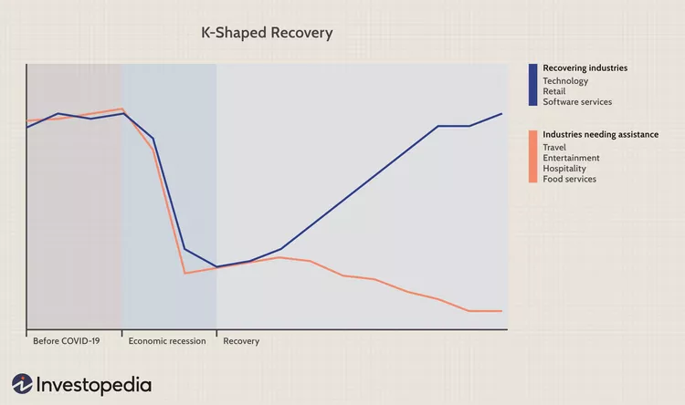
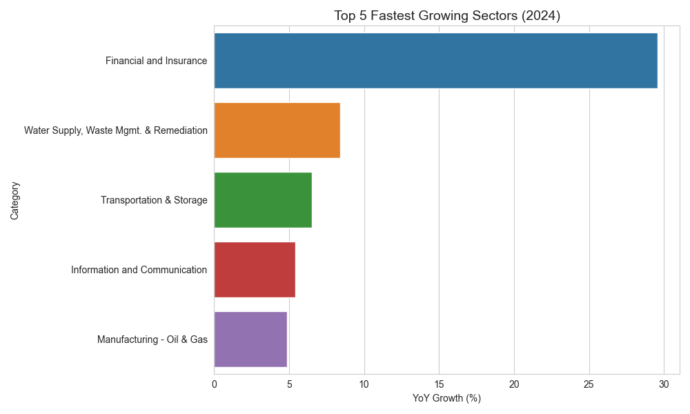
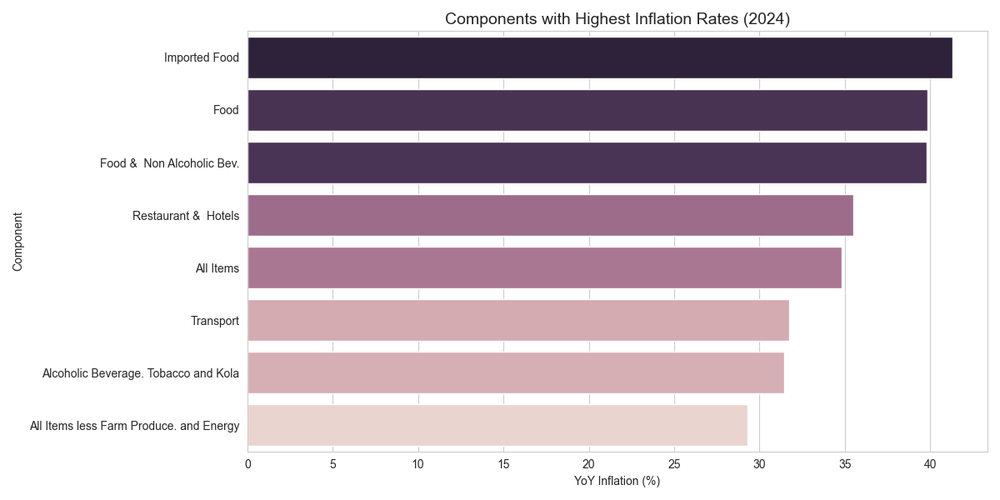

# Analytical Report on Nigeria’s Economy: Performance & Way Forward (2015–2024)

**Date:** December 31, 2025

**Prepared by:** `Joshua Edun`

**Tools Used:** Python (Pandas, Matplotlib, Seaborn)

---

## 📌 Executive Summary

### The "K-Shaped" Economic Divergence

According to Investopedia.com, a K-shaped recovery "occurs when, following a recession, different parts of the economy recover at different rates, times, or magnitudes".

The data tells a similar story in the Nigerian economy: while the financial and digital economies are booming, the real sector — manufacturing, telecommunications, and consumer goods — is contracting. This phenomenon is 3 main external and internal shocks: aggressive currency devaluation, the removal of the petrol subsidy, and persistent security challenges in the agricultural belt.

### Key Highlights

- **Financial Sector Boom:** The Financial & Insurance sector has decoupled from the broader economy, recording a **29.6% YoY growth in 2024**. This is largely a result of high-interest-rate environments and foreign exchange (FX) revaluation gains.

- **Cost of Living Crisis:** Inflation has become a chronic issue. In 2024, **Imported Food inflation reached 41.3%**. The average Nigerian's diet is being affected by exchange rate volatility.

- **Corporate Profitability Shift:** While **Zenith Bank** saw profits jump by **153% in 2023**, industrial giants like **MTN Nigeria** and **Nestlé Nigeria** recorded losses, with MTN’s losses widening by **192% in 2024** due to massive FX-related liabilities.

### Core Insight

Policy intervention must shift from targeting mere GDP growth to **sector-specific stabilization**, particularly focusing on the FX-exposed manufacturing and telecommunications sectors which are the country's primary non-oil employers.

---

## 📊 1. GDP Analysis: The Shift from Oil to Services

### Overview

For decades, Oil & Gas was the heartbeat of the nation, but between 2015 and 2024, the sector has struggled with a **CAGR of -4.4%**. In contrast, the Services sector—led by Finance and ICT has stepped in to fill the vacuum, though it does not yet provide the same level of foreign exchange liquidity as the oil sector once did.

### 🚀 Top 5 Sectors by Growth (2024)

1. **Financial & Insurance (29.6%):** Higher Central Bank policy rates and the revaluation of dollar assets have created a windfall for Tier-1 banks.
2. **Water Supply & Waste Management (8.4%):** A surprising outlier, indicating increased urbanization and privatization of utility services.
3. **Transportation & Storage (6.5%):** The sector is experiencing a recovery from the downturns of 2020 - 2022, though it is still hampered by high fuel costs.
4. **Information & Communication (5.4%):** Despite corporate losses in the sector, the _volume_ of digital activity (data usage) continues to grow, making it a "necessity" in the modern Nigerian economy.
5. **Manufacturing - Oil & Gas (4.8%):** Driven by a mild recovery in refining and midstream activities.

**Figure 1:** _Top 5 sectors by growth rate in 2024. Finance and ICT outpace traditional sectors._

### 🧱 Top Contributors to GDP (2024)

- **Agriculture (24.6%):** Remains the largest contributor but suffers from "low-value" output. It is the nation's safety net but lacks the productivity to drive industrialization.
- **ICT (17.7%):** Has cemented its position as the "new oil," contributing nearly a fifth of the GDP.

**Figure 2:** _GDP growth trends of key sectors of the Nigerian economy._

---

## 📉 2. CPI & Inflation: The Food Security Emergency

### Inflation Dynamics

The removal of the fuel subsidy in 2023 and the subsequent unification of the Naira exchange rate served as major shocks to the Consumer Price Index (CPI).

### 🔥 Highest Cost Drivers (2024)

- **Imported Food (+41.3%):** Because Nigeria remains heavily dependent on imported wheat, sugar, and specialty fats, the devaluation of the Naira means food insecurity is on the rise.

- **General Food (+39.8%):** Driven by domestic logistics costs (diesel) and the displacement of farmers in the North-Central "food belt." due to conflict.

- **Transport (+31.7%):** Fuel prices has increased the "last-mile" cost of every good sold in the country.

### ⏳ Cumulative Impact (2015–2024)

The data suggests that food prices have quintupled (500% increase) over the decade. This has led to a **"hollowing out" of the middle class**, where discretionary spending on **Entertainment**, **Real Estate**, and **Non-essential Services** has collapsed as households reallocate most of their income to food.

**Figure 3:** Year-over-year inflation rates by CPI component in 2024, showing the rise of costs in Imported Food (+41.3%), General Food (+39.8%), and Transport (+31.7%) categories. This suggests the cascading effects of Naira devaluation and fuel subsidy removal on consumer prices.

---

## 🏢 3. Company–Sector Analysis: A Tale of Two Economies

While a sector may show "growth" in GDP terms (which measures output volume), companies within that sector may be dying due to value erosion.

| Company           | Sector        | Sector Trend (2024) | Company Trend (PAT 2024) | Insight                                                          |
| ----------------- | ------------- | ------------------- | ------------------------ | ---------------------------------------------------------------- |
| **Zenith Bank**   | Financials    | +29.6% (Boom)       | +57% Profit              | **Winner:** Beneficiary of high rates & FX revaluation.          |
| **Seplat Energy** | Oil & Gas     | +4.8% (Recovery)    | +16.9% Profit            | **Resilient:** Dollarized revenues provide a natural hedge.      |
| **MTN Nigeria**   | ICT           | +5.4% (Growth)      | -192% Loss               | **FX Hostage:** High volume growth but wiped out by USD debt.    |
| **Nestlé Niger**  | Manufacturing | +8.6% (Growth)      | -164.6bn (Loss)          | **Distressed:** Unable to pass all costs to a weakened consumer. |

|                                                                                                                    |                                                                                                                                              |
| ------------------------------------------------------------------------------------------------------------------------------------------------------------------------------------------------------------------------ | ------------------------------------------------------------------------------------------------------------------------------------------------------------------------------------------------------------------------------------------------- |
| **Figure 4a:** MTN PAT performance tracked against GDP growth in the ICT sector. MTN suffer losses despite positive GDP growth. | **Figure 4b:** Zenith Bank's profitability trends mirrors GDP growth in the overall Finance and Insurance sector. |

### 🧠 Key Insight

Sectoral growth may not directly translate to a company's bottom-line performance. People are using more data (MTN) and buying more seasoning cubes (Nestlé), but the companies cannot convert this activity into profit because their cost of capital and inputs (denominated in USD) has outpaced the local purchasing power.

---

## 🧭 4. Recommendations

### 🏛️ For the Nigerian Economic Advisory Team

1. **Prioritize "Food Sovereignty":** Allocating loans for farmers can only go sofar. More effort should be placed on **secure transport corridors** and solar-powered cold storage to reduce the post-harvest loss that keeps domestic food inflation high.

2. **FX Intervention for Essential Industry:** Introduce a "Managed Floating Window" specifically for critical manufacturing inputs to prevent the total exit of multinational producers.  `what does this mean`

3. **Taxing the Windfall:** Consider a temporary "Windfall Tax" on banking revaluation gains to fund infrastructure in struggling sectors, ensuring the financial boom supports the real sector recovery.

### 💼 For Investors

- **Overweight: Tier-1 Banks.** They remain the most efficient hedge against Naira volatility and high-inflation environments.
- **Overweight: Upstream Energy.** Companies like **Seplat** represent a way to play the Nigerian economy with "hard currency" protection. `rewrite`
- **Avoid: Highly Leveraged Consumer Goods.** Until the exchange rate stabilizes, these firms will continue to report "accounting losses" that prevent dividend payouts.

---

## 📚 References

1. **National Bureau of Statistics (NBS).** _2024 GDP and CPI Reports._ [Source: nigerianstat.gov.ng]
2. **Central Bank of Nigeria (CBN).** _Monetary Policy Committee Communiqués (2023-2024)._
3. **World Bank.** _Nigeria Development Update: Turning the Corner._ (June 2024).
4. **K-Shaped Recovery Concept.** _IMF Regional Economic Outlook for Sub-Saharan Africa (2024)._
